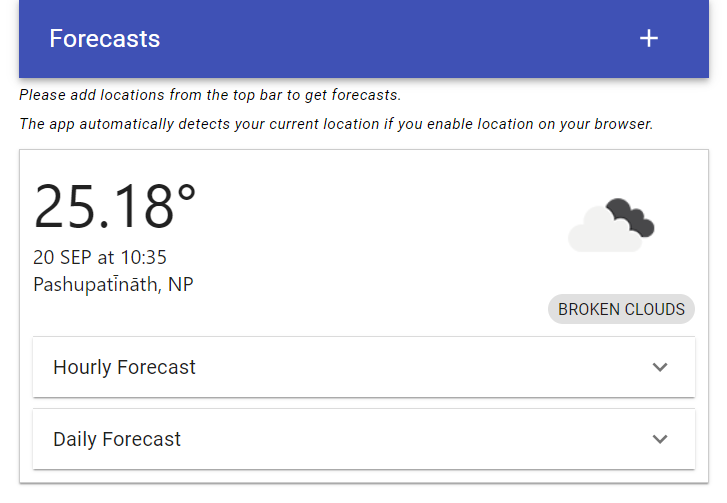
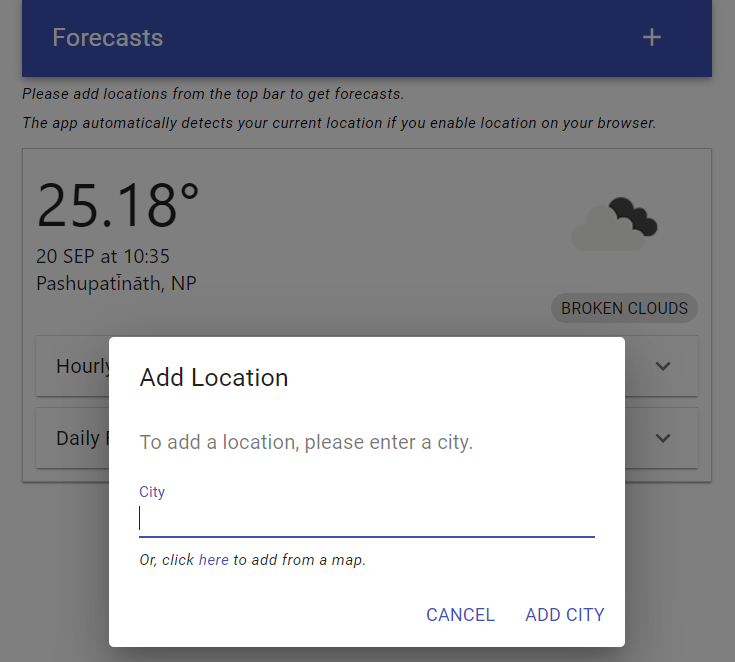
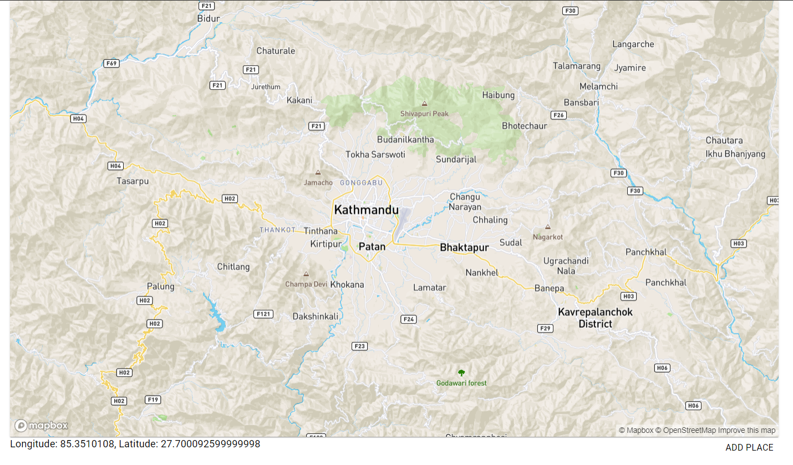

# Forecasts

1. [Introduction](#introduction)
2. [Getting Started](#getting-started)
3. [Usage](#usage)
4. [Screenshots](#screenshots)
5. [Dependencies](#dependencies)
6. [Technical Notes](#technical-notes)

## Introduction

The app lets you view the forecasts for your city or any place in the world.

Using the application, you can:
1. View the weather details of multiple places from the homepage.
  - View hourly details for the current day.
  - View daily details for up to a week.
2. Add a city by clicking the + icon at the top.
3. Add a place by choosing a latitude and longitude from a map.

## Getting Started

1. Clone the repo

2. In the project directory, install all the dependencies using:

  `yarn`

3. Run the project using:

  `yarn start`

The app runs on http://localhost:3000.

## Usage

The home page opens with your current city's forecast if you have enabled location. Here, you can:

1. View hourly forecasts for the added cities.
2. View daily forecasts for the added cities.
3. Add new place by city name.
4. Add new place from a map.

## Screenshots

1. Home page

2. Add city

3. Add place from map

## Dependencies

1. @material-ui/core ^4.11.1
2. @material-ui/icons ^4.11.2
3. mapbox-gl
